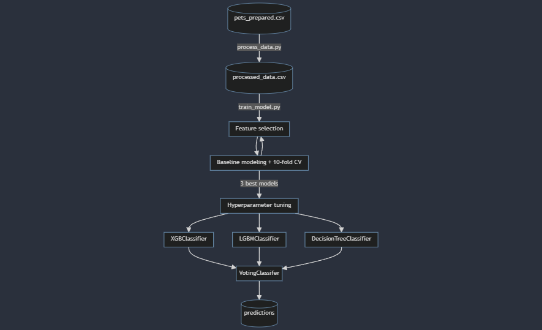
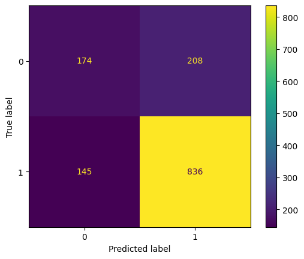
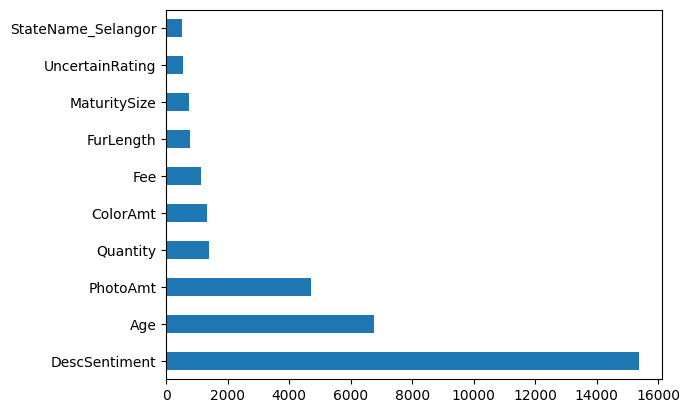

# petsfinder.my Pet Adoption Prediction Project

By: Zhi Chao CHENG

zccheng97@gmail.com

## Setup
### Installing all dependencies:

```
$ pip install -r requirements.txt
```

### Requirements:

```
Python version: 3.12.2
OS Platform: Windows
OS Version: Windows 10
```
All package requirements can be found in `requirements.txt`.


### Run instructions
Use `run.sh` to execute the files after installing required packages.

Make use of the `src/model/config.json` file to change run settings. By default it is set to run a prediction using the finalised model. 

* Use `features` to select which features to use in training.
* `create_xy` parameters allow to choose whether to scale continuous features and/or one-hot encode categorical variables.
* `list_of_models` is a list of models to include when running baseline training.
* `run_modes` are the available modes of training and prediction.
* `baseline_train_params` and `baseline_cv_params` allow selection of whether or not to log the results in `logs/output.csv` and filling in details of model name and remarks on training.
* `HP_tuning_params` allow choosing which of the 3 models to perform tuning and how many trials to run. Results are saved in `sqlite.db` to allow tuning to be paused and continued at a later time.
* `voting_classifier_params` are the optimised parameters to use in the `VotingClassifier`mode.
* `voting_classifier_train__params` allow selection of whether or not to log the results of `VotingClassifier` training in `logs/output.csv` and filling in details of model name and remarks on training. Also generates the confusion matrix of running the ensemble model on holdout test data and feature importances graph as png files in the `logs` directory.
* `use_existing_model` allow use of a saved model found in `saved_model` to be used to run predictions on the holdout test set.

### File structure

```
C:.
│   eda.ipynb
│   README.md
│   requirements.txt
│   run.sh
│   sqlite.db
│
├───logs
│       flowchart.png
│       output.csv
│       test_confusion_matrix.png
│       test_feat_importances.png
│
├───saved_model
│       final_model.sav
└───src
    ├───dataprep
    │       process_data.py
    │
    └───model
        │   config.json
        │   train_model.py
        │   utils.py
        │
        └───__pycache__
                config.cpython-312.pyc
                utils.cpython-312.pyc
```

## Exploratory Data Analysis

The data source for this project was obtained from PetFinder.my, which has been Malaysia’s leading pet adoption portal since 2008 with a database of more than 150,000 animals. The prepared dataset included tabular data, with text inputs included.

There are a total of 14993 samples in this dataset, with 49 columns, `AdoptionSpeed` being the main predictor used to quantify pet adoption rates.

### Key Findings

#### Overview

- There are no duplicates in this dataset.
- There are 3 columns with "NaN" or invalid data, namely the `Name`, `Description` and `BreedName` columns.

#### `PetID`

`PetID` is the unique hash for each pet profile. It is verified that there are as many unique values as there are total number of samples.

#### `AdoptionSpeed`

`AdoptionSpeed` is the duration between the date the pet is received and the date the pet is adopted, given as a categorical label with `0` representing 0 days while `4` represents no adoption even after 100 days.

- The distribution of the data is mostly even between the labels, with the exception of `0` making up only 2.7% of the dataset.

#### `Type`

Refers to the species of animal, either `Cat` or `Dog`.

- There are more dogs than cats, with the proportion of cats being adopted sooner being more than dogs.

#### `Name`and ``NameorNO`

Supposed to contain the name of the pets, however:

- Some pets have no names, others contain descriptions of the animals such as "Lost Dog" or "2 Mths Old Cute Kitties".
- Some two/three-letter names are incoherent letter-number combinations.
- Incoherent names are also labeled as `Y` under `NameorNO`.

#### `Age`

Age of the pet given in months.

- More than half of the total number being less than 10 months old.
- Generally younger pets tend to be adopted earlier than older pets.

#### `Breed1`, `Breed2` and `BreedPure`

The exact breed of the dogs and cats are firstly given as a boolean BreedPure value where purebreds are given a value of `Y` and mixed breeds with `N`.

For purebreads, the breed is given in the BreedName column with its corresponding unique ID (between 0 and 306) given in Breed1.For mixed breeds, the primary breed is given in Breed1 while the secondary Breed is given in Breed2. However:

- There is an additional ID for the breed, `307`, which is simply used to designate mixed breed animals, while other mixed breeds have two different breeds given.
- Some breeds labeled as `307` or Mixed Breed having their labels repeated in Breed2 after being filled in Breed1.
- Some pure breeds have the same value given in the `Breed1` and `Breed2` columns.

Generally, pure breed pets tend to be adopted faster.

#### `Gender`

This feature gives the gender of the animals, with a `Mixed` label to account for mixed genders among animals where the `Quantity` is more than 1.

- Some pets have `Quantity` more than 1 but a non `Mixed` gender given.

#### `Color`

Colors are given as unique color IDs each corresponding to one of 7 colours, with 3 uniquely labelled columns representing the maximum mix of 3 colours for a pet. `ColorAmt` refers to the number of colours a pet may have, capped at 3.

- `ColorAmt` does not seem to affect `AdoptionSpeed`.

#### `MaturitySize`

Size of the pets, ranging from `Small` to `xtra Large`.

- There are only 33 `xtra Large` pets, hence it is an outlier label.
- `xtra Large` and `Small` pets are likely to have lower `AdoptionSpeed`.

#### `FurLength`

Average fur length of the pets.

- Most pets have short fur, with long-furred pets being the least common.
- `Long` fur pets have the highest adoption rate, with `Small` fur pets having the lowest.

#### `Vaccinated`, `Dewormed`, `Sterilised`, `Health`

Each refers to a particular health check on the pets, with health label representing whether the pet is injured.

- Pets that are not vaccinated have a higher adoption rate.
- Pets that are not dewormed also have slightly higher adoption rate compared to dewormed pets.
- Non-sterilised pets have a higher adoption rate.
- Almost all pets are labelled `Healthy`, with about 500 total pets with some injury recorded.

#### `Quantity`

Refers to the number of pets listed in each sample entry.

- Out of the about 15k samples there are only 416 that have more than 5 pets in a group and out of those, 43 have more than 10 pets in a group.
- `Description` and `Quantity` of pets sometimes do not tally.
- Adoption rates tend to decrease as `Quantity` increases.

#### `Fee`

Refers to the adoption fee paid by whoever is adopting the animal(s) listed in each sample. This ranged from a value of 0 (meaning free adoption) to a value of 3000 paid.

- More than 12000 out of the almost 15000 pets, are adopted without paying a fee.
- Higher fee pets have lower adoption rates.

#### `State`

Refers to the state which the pets originated from, given as a unique 5 digit ID representing each of the 14 states of Malaysia.

- There is a large class imbalance in that most of the pet data originates from two states, Selangor and KL.
- The largest proportion of the shortest `AdoptionSpeed` of 0 and 1 are the pets that originate from Johor, while pets from Perak have the smallest.
- The largest proportion of the longest `AdoptionSpeed` of 4 are pets from Negeri Sembilan, while pets from Selangor, also where the majority of the pets originate from, have the smallest proportion of `AdoptionSpeed` 4.

#### `RescuerID`

RescuerID refers to the unique ID hash of each rescuer. There are 5595 unique rescuers in total, with the each of the top 5 rescuers in terms of most animals rescued having a count of more than 150 each.

The number of pets rescued by a particular rescuer does not affect the `AdoptionSpeed` by much.

#### `VideoAmt` and `PhotoAmt`

These features refer to the total number of videos and photos uploaded for the pets.

- The number of pets with 0 videos is 14419 which makes up almost all the data.
- Number of pets with 0 photos are only 341 out of the about 15000 samples.
- Adoption rate generally increases with photo count.

#### `Description`

Description contains the profile write-up for each pet/group of pets. The primary language used is English, with some in Malay or Chinese.

- Descriptions with shorter character counts seem to indicate pets with higher adoption rates, but otherwise it is not a very discerning feature.

## Feature Engineering



### `breed_clean`

- Changed all `Breed2` values to `0` for cases where `Breed1 == 307`.
- Changed all `Breed2` values to `0` for cases where `BreedPure == "Y"`.
- Added another column `KnownMixed` which can be `Pure`, `KnownMixed` or `UnknownMixed` depending on whether the 2 breeds are known in an animal labeled as `MixedBreed`.

### `full_color`

Adds a column that joins the color IDs of the 3 Color columns and treats pet colour as a combination of all 3 colours.

### `rescue_rating`

Adds a `RescueRating` column that creates a `value_count()` of the `RescuerID` feature. This is used to generate a `RescuerID_or_New` feature that returns the rescuer ID if they have logged more than 5 rescues or generates a `Threshold_Not_Met` label otherwise.

### `health_uncertainty`

Adds a column that is given `Y` yes value if all 3 `Vaccinated`, `Dewormed`, and `Sterilised` columns are `Not Sure`.

### `desc_length`

Adds a column that counts the number of words in the `Description` column.

### `desc_Sentiment`

Adds a column that runs the Huggingface "sentiment-analysis" on `Description` after performing case normalisation and removing any unicode characters except punctuation marks.

## Ethical Considerations

### y-label: Using `Adopted` over `AdoptionSpeed`

- Less cardinality
- Ethical concerns: Maximising correct predictions for `AdoptionSpeed` can make potentially make the model biased towards trying to minimise the time between registration and adoption. This may lead to consequences such as rushing the adoption process and not finding owners who are responsible for the pet and ensuring animal welfare.
- Prioritising pets with highest AdoptionSpeed, which is essentially all the `0` labels in Adopted. This is also an ethical concern as we want staff to prioritise identifying pets which may be predicted to have a longer adoption time to improve their well being.

### Evaluation Metric: F2-Score

Accuracy is one of the most ubiquitous metrics used to measure percentage of correct predictions with the ground truth values. However, this method is limited in its inability to discern any chance agreements.

There is also a class imbalance, where there is an almost 70:30 ratio of positive to negative labels for `Adopted`.

The labels are flipped, 1 to 0 and vice versa, to utilise F2 as a metric.
F2 is the harmonic mean of the precision and recall. F-measure is used here as we want to identify how well the positive class is predicted, and by flipping the labels pets that are adopted after more than 100 days are treated as the positive class.

`beta = 2` places higher weightage placed on recall as one secondary objective is to prioritise reducing false negatives.

### RescuerID

- Found to improve predictions if used as the `value_counts()` of the `RescuerID` column.
- This causes bias in the data as there are some rescuer IDs which have a larger proportion of pets that may be unadopted due to other underlying factors. A model trained using this feature may perpetuate this bias.
- Also need to deal with data shift as each new data point will change the `value_counts()`.

### "Intrinsic" features vs "Extrinsic"

- The features used in this dataset can be considered as either "intrinsic" or "extrinsic" in nature. The former refers to biological or mostly immutable traits of the pet, such as its `Name`, `Color`, `Breed` and `Gender`. The latter refers to factors that can be altered with human intervention, such as `Description`, `VideoAmt` and `PhotoAmt`.
- A model trained on the intrinsic features of the pets may be na ethical concern as it may result in bias towards or against certain biological traits which cannot be altered. If a pet can be concluded to have a likely long adoption time it may be ignored in favour of more adoptable pets.
- However, excluding these features reduce the performance of the model by a significant amount (using the F2 score as a consideration).
- The use of the F2-score and the priority of this developed model to focus on identifying pets with `Adopted` label of `0` is worth the tradeoff in potential bias that may be created.

## Data Preprocessing

- The following features were selected for use in the model training.

```
"features": {
    "cats": [
      "Type",
      "Breed1",
      "Breed2",
      "Gender",
      "BreedPure",
      "KnownMixed",
      "VaccinatedName",
      "DewormedName",
      "SterilizedName",
      "HealthName",
      "StateName",
      "FullColor"
    ],
    "conts": [
      "Age",
      "ColorAmt",
      "Quantity",
      "Fee",
      "VideoAmt",
      "PhotoAmt",
      "UncertainRating",
      "MaturitySize",
      "FurLength",
      "DescSentiment"
    ]
  }
```

- Used `OneHotEncoder` on all categorical columns and `StandardScaler` on all continuous columns.
- Split data into train, validation and test sets in a 9:1:1 ratio.

## Model Training

- The following models were considered and trained with the processed data.

```
"list_of_models":[
    "Logistic Regression",
    "SVC",
    "Ridge",
    "K-Neighbors Classifier",
    "Decision Tree",
    "Random Forest",
    "XGB Classifier", 
    "LGBM Classifier",
    "AdaBoost Classifier"
  ]
```

### Choice of Features:
- `DescLength`, `NameorNO` columns do not seem to improve predictions.
- Using `Age` over `AgeBins` does not seem to improve predictions.
- Using `PhotoAmt` over `PhotoBins` does not seem to improve predictions.
- Using `DescSentiment` improved predictions.

### Choice of Models:
- `SVC()` takes long training time for more features, due to the large number of features generated from on-hot encoding this model is not selected for the final prediction.
- Models such as `LogisticRegression` and `RidgeClassification` were found to be able to give as good predictions as the tree-based and boosting machines but only if continuous features were binned. When continuous features were used the latter models were able to outperform the linear models.
- Tuned the `LGBMClassifier`, `XGBClassifier`, and `DecisionTreeClassifier`, which were the baseline models with the highest F2-scores, to identify parameters to maximise the metric. Using these ensembling methods such as tree boosting and decision trees also allow easy visualisation of feature importances which are the distinguishing features which these models use in their decision making splits, allow us to fulfil the goal of investigating adopters' preferences by isolating the highest importance features.
- The top 3 models with the highest validation F2-scores were used in a hard `VotingClassifier` ensemble.

## Model Evaluation

- Model was evaluated against the holdout test dataset, achieving a F2-score of 0.4710.
### Confusion Matrix

### Feature Importances


`DescSentiments` was found to be the most important feature in distinguishing whether a pet would be adopted within 100 days, followed by the pet's `Age` and the `PhotoAmt`, `Quantity` and `ColorAmt`.

Out of these, 3 of them are "extrinsic" features which through human intervention, can be improved or adjusted to help increase the adoption rates of any pets which have a lower adoption rate. 

The `Description`, which has been analysed using only a quick baseline NLP sentiment analysis, can also be the focus of future model improvements as just this baseline alone is enough to extract enough of the feature for it to be a good classifier.